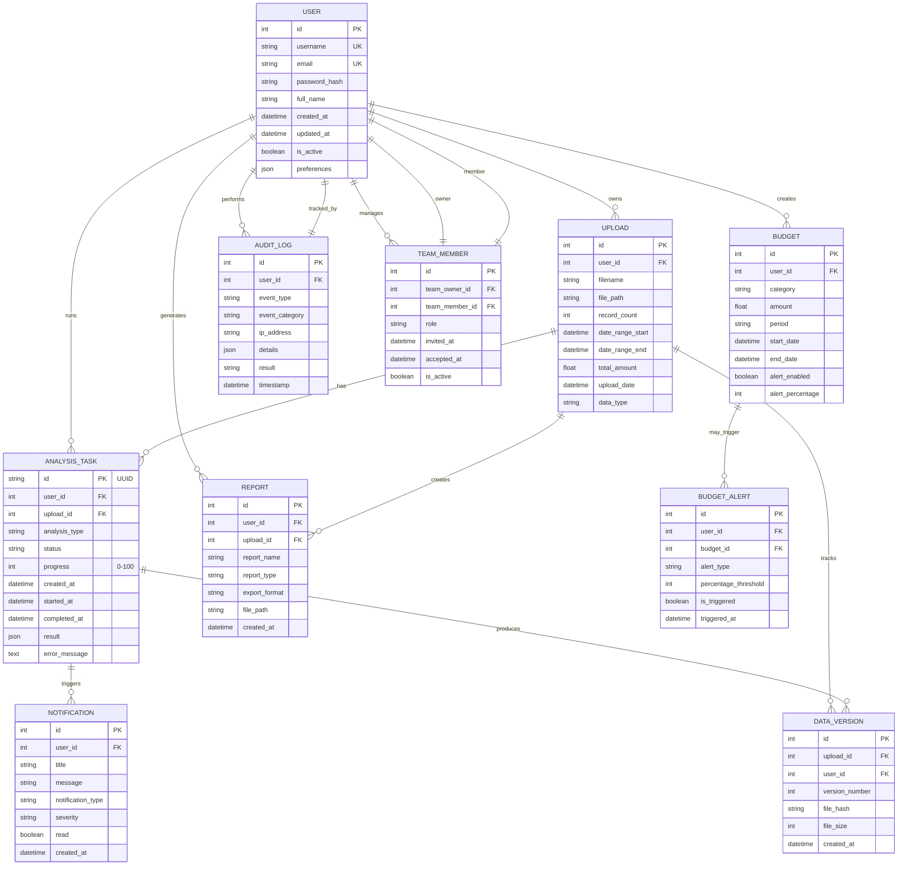
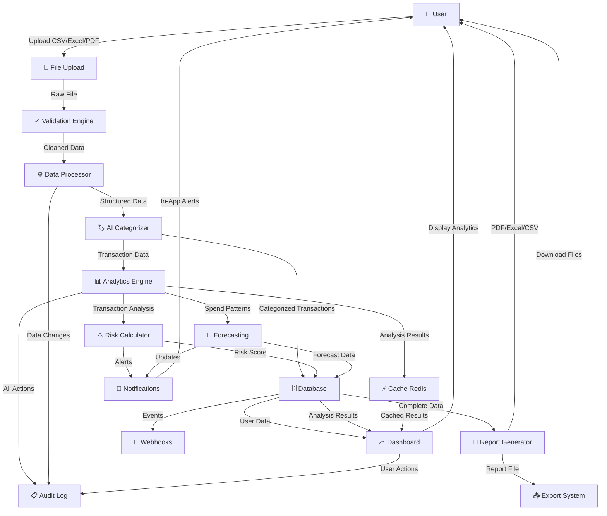
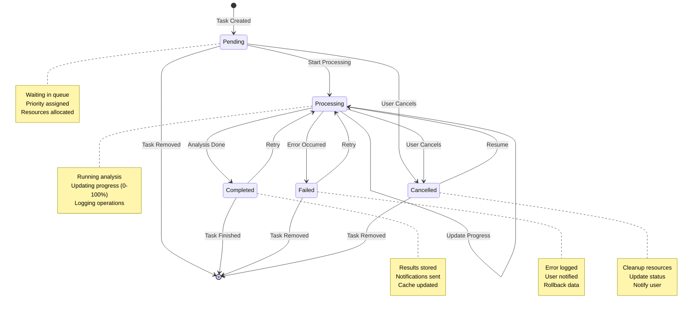
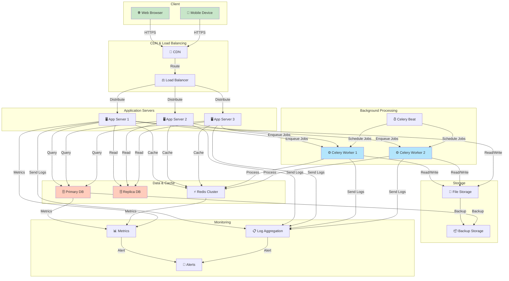
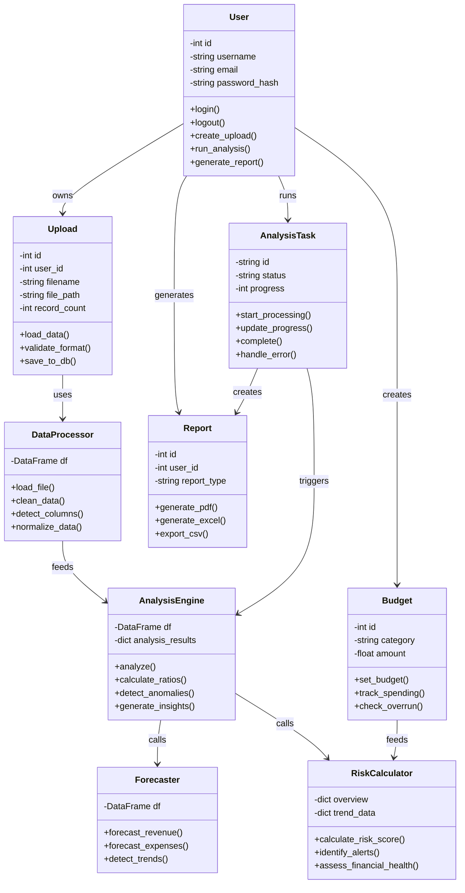
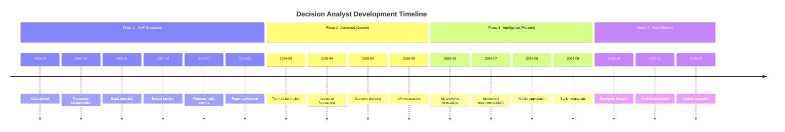

# Decision Analyst - System Diagrams
## Visual Architecture & Workflows with Mermaid

---

## 1. ER Diagram (Entity Relationship)

Core entities and their relationships for the Decision Analyst system.

---

## 2. Data Flow Diagram (DFD)

System-level data flows showing how information moves through Decision Analyst.

---

## 3. State Transition Diagram

Analysis task lifecycle showing all possible states and transitions.

---

## 4. Use Case Diagram

User interactions and system capabilities in Decision Analyst.

```mermaid
graph TB
    User["👤 User"]
    Admin["👨‍💼 Admin"]
    TeamMember["👥 Team Member"]
    
    subgraph "Data Management"
        UC1["📁 Upload File"]
        UC2["🔄 Load Sample Data"]
        UC3["📊 View Upload History"]
        UC4["🔙 Rollback Version"]
    end
    
    subgraph "Analysis & Insights"
        UC5["📈 Run Analysis"]
        UC6["🏷️ Categorize Transactions"]
        UC7["📊 View Analytics Dashboard"]
        UC8["🔮 View Forecasts"]
        UC9["⚠️ View Risk Score"]
    end
    
    subgraph "Budget Management"
        UC10["💰 Set Budget"]
        UC11["📊 Track Budget Progress"]
        UC12["🔔 Budget Alerts"]
    end
    
    subgraph "Reporting"
        UC13["📄 Generate Report"]
        UC14["📤 Export Report"]
        UC15["📋 View Report History"]
    end
    
    subgraph "Team Collaboration"
        UC16["👥 Invite Team Member"]
        UC17["🔐 Manage Permissions"]
        UC18["📤 Share Analysis"]
        UC19["👁️ View Shared Data"]
    end
    
    subgraph "Account & Settings"
        UC20["⚙️ Configure Preferences"]
        UC21["🔐 Manage Security"]
        UC22["📊 View Audit Log"]
    end
    
    subgraph "Administration"
        UC23["👥 Manage Users"]
        UC24["🔧 System Configuration"]
        UC25["📋 View System Logs"]
    end
    
    User -->|Uses| UC1
    User -->|Uses| UC2
    User -->|Uses| UC3
    User -->|Uses| UC4
    User -->|Uses| UC5
    User -->|Uses| UC6
    User -->|Uses| UC7
    User -->|Uses| UC8
    User -->|Uses| UC9
    User -->|Uses| UC10
    User -->|Uses| UC11
    User -->|Uses| UC12
    User -->|Uses| UC13
    User -->|Uses| UC14
    User -->|Uses| UC15
    User -->|Uses| UC16
    User -->|Uses| UC17
    User -->|Uses| UC20
    User -->|Uses| UC21
    User -->|Uses| UC22
    
    TeamMember -->|Uses| UC7
    TeamMember -->|Uses| UC8
    TeamMember -->|Uses| UC11
    TeamMember -->|Uses| UC13
    TeamMember -->|Uses| UC19
    
    Admin -->|Uses| UC1
    Admin -->|Uses| UC5
    Admin -->|Uses| UC23
    Admin -->|Uses| UC24
    Admin -->|Uses| UC25
    Admin -->|Uses| UC22
    
    style UC1 fill:#e1f5ff
    style UC5 fill:#f3e5f5
    style UC10 fill:#fff3e0
    style UC13 fill:#f1f8e9
    style UC16 fill:#fce4ec
```

---

## 5. Sequence Diagram

Typical workflow sequence: User uploads file and runs analysis.

```mermaid
sequenceDiagram
    actor User
    participant UI as Web UI
    participant API as Flask API
    participant Processor as Data Processor
    participant Analyzer as Analytics Engine
    participant DB as Database
    participant Cache as Redis Cache
    participant Notifier as Notifications
    
    User->>UI: 1. Upload CSV File
    UI->>API: 2. POST /api/upload
    
    API->>Processor: 3. load_file()
    Processor->>Processor: 4. detect_columns()
    Processor->>Processor: 5. clean_data()
    Processor->>DB: 6. save_upload_record()
    DB-->>API: 7. upload_id
    
    API-->>UI: 8. File processed successfully
    UI-->>User: 9. Show dashboard
    
    User->>UI: 10. Click "Run Analysis"
    UI->>API: 11. POST /api/analyze
    
    API->>API: 12. create_analysis_task()
    API->>DB: 13. save_task(status='pending')
    DB-->>API: 14. task_id
    
    API-->>UI: 15. Analysis queued
    UI-->>User: 16. Show progress: 0%
    
    note over Processor,Analyzer: Background Processing
    
    Processor->>Processor: 17. Load data from upload
    Processor->>Processor: 18. normalize_data()
    API->>DB: 19. update_task(progress=20%)
    
    Analyzer->>Analyzer: 20. calculate_ratios()
    API->>DB: 21. update_task(progress=40%)
    
    Analyzer->>Analyzer: 22. detect_anomalies()
    API->>DB: 23. update_task(progress=60%)
    
    Analyzer->>Analyzer: 24. generate_insights()
    API->>DB: 25. update_task(progress=80%)
    
    Analyzer->>Cache: 26. cache_results()
    API->>DB: 27. save_analysis_result()
    API->>DB: 28. update_task(status='completed')
    DB-->>Cache: 29. Clear old cache
    
    API->>Notifier: 30. send_completion_notification()
    Notifier-->>User: 31. 🔔 Analysis Complete!
    
    UI->>API: 32. GET /api/get-analysis
    API->>Cache: 33. get_cached_results()
    Cache-->>API: 34. cached_data
    API-->>UI: 35. analysis_results
    
    UI-->>User: 36. Display Dashboard with Results
    
    User->>UI: 37. Click "Generate Report"
    UI->>API: 38. POST /api/reports
    
    API->>DB: 39. get_analysis_data()
    DB-->>API: 40. complete_data
    API->>API: 41. generate_pdf()
    API->>DB: 42. save_report_record()
    DB-->>API: 43. report_id
    
    API-->>UI: 44. report_url
    UI-->>User: 45. Download Report
```

---

## 6. Component Diagram

System components and their interactions.

```mermaid
graph TB
    subgraph "Client Layer"
        WebApp["🌐 Web Application"]
        MobileApp["📱 Mobile App"]
    end
    
    subgraph "API Layer"
        AuthAPI["🔐 Auth Module"]
        DataAPI["📁 Upload Module"]
        AnalysisAPI["📊 Analysis Module"]
        ReportAPI["📄 Report Module"]
        AdminAPI["⚙️ Admin Module"]
    end
    
    subgraph "Business Logic"
        DataProcessor["🔧 Data Processor"]
        Analytics["📈 Analytics Engine"]
        Forecaster["🔮 Forecaster"]
        RiskEngine["⚠️ Risk Calculator"]
        ReportGen["📋 Report Generator"]
    end
    
    subgraph "Infrastructure"
        DB["🗄️ PostgreSQL DB"]
        Cache["⚡ Redis Cache"]
        Queue["📤 Task Queue"]
        FileStorage["💾 File Storage"]
    end
    
    subgraph "External Services"
        EmailService["📧 Email Service"]
        OAuthProvider["🔐 OAuth Provider"]
        GroqAI["🤖 Groq AI API"]
    end
    
    WebApp -->|HTTP/HTTPS| AuthAPI
    WebApp -->|HTTP/HTTPS| DataAPI
    WebApp -->|HTTP/HTTPS| AnalysisAPI
    WebApp -->|HTTP/HTTPS| ReportAPI
    
    MobileApp -->|HTTP/HTTPS| AuthAPI
    MobileApp -->|HTTP/HTTPS| DataAPI
    MobileApp -->|HTTP/HTTPS| AnalysisAPI
    
    AuthAPI -->|Authenticate| OAuthProvider
    AuthAPI -->|Store User| DB
    AuthAPI -->|Cache Tokens| Cache
    
    DataAPI -->|Process| DataProcessor
    DataAPI -->|Store Files| FileStorage
    DataAPI -->|Save Metadata| DB
    
    AnalysisAPI -->|Process Data| DataProcessor
    AnalysisAPI -->|Run Analytics| Analytics
    AnalysisAPI -->|Queue Job| Queue
    AnalysisAPI -->|Store Results| DB
    AnalysisAPI -->|Cache Results| Cache
    
    Analytics -->|Get AI Insights| GroqAI
    Analytics -->|Predict Trends| Forecaster
    Analytics -->|Calculate Risk| RiskEngine
    
    ReportAPI -->|Generate| ReportGen
    ReportAPI -->|Store Report| FileStorage
    ReportAPI -->|Save Metadata| DB
    
    AdminAPI -->|Manage System| DB
    AdminAPI -->|Monitor Health| Cache
    
    Queue -->|Background Jobs| Analytics
    Queue -->|Background Jobs| ReportGen
    Queue -->|Background Jobs| Forecaster
    
    FileStorage -->|Store| DB
    
    ReportGen -->|Send Email| EmailService
    
    DataProcessor -->|Read/Write| DB
    Analytics -->|Read/Write| DB
    
    style WebApp fill:#e3f2fd
    style MobileApp fill:#e3f2fd
    style DB fill:#fff3e0
    style Cache fill:#fff3e0
    style GroqAI fill:#f3e5f5
```

---

## 7. Deployment Architecture

How Decision Analyst is deployed and scaled.

---

## 8. Class Diagram (Key Classes)

Object-oriented structure of core components.

---

## 9. Timeline Diagram

Key milestones in Decision Analyst development.

---

## 10. API Endpoints Map

REST API structure and endpoints.

```mermaid
graph LR
    API["REST API"]
    
    subgraph "Auth"
        A1["/auth/login"]
        A2["/auth/logout"]
        A3["/auth/register"]
        A4["/auth/oauth"]
    end
    
    subgraph "Upload"
        U1["/api/upload"]
        U2["/api/load-sample"]
        U3["/api/preview-data"]
        U4["/api/get-reports"]
    end
    
    subgraph "Analysis"
        AN1["/api/analyze"]
        AN2["/api/smart-analyze"]
        AN3["/api/advanced-analytics"]
        AN4["/api/categorize"]
    end
    
    subgraph "Reports"
        R1["/api/reports"]
        R2["/api/reports/ID"]
        R3["/api/reports/ID/download"]
    end
    
    subgraph "Budget"
        B1["/api/budgets"]
        B2["/api/budgets/ID"]
        B3["/api/budget-alerts"]
    end
    
    subgraph "Tasks"
        T1["/api/tasks/create"]
        T2["/api/tasks/ID/status"]
        T3["/api/tasks/ID/cancel"]
        T4["/api/batch/process"]
    end
    
    subgraph "Team"
        TE1["/api/team/invite"]
        TE2["/api/team/members"]
        TE3["/api/team/permissions"]
    end
    
    subgraph "System"
        S1["/api/health"]
        S2["/api/docs"]
        S3["/api/performance-metrics"]
    end
    
    API --> A1
    API --> A2
    API --> A3
    API --> A4
    API --> U1
    API --> U2
    API --> U3
    API --> U4
    API --> AN1
    API --> AN2
    API --> AN3
    API --> AN4
    API --> R1
    API --> R2
    API --> R3
    API --> B1
    API --> B2
    API --> B3
    API --> T1
    API --> T2
    API --> T3
    API --> T4
    API --> TE1
    API --> TE2
    API --> TE3
    API --> S1
    API --> S2
    API --> S3
    
    style API fill:#2196F3,color:#fff
    style A1 fill:#FF5722
    style U1 fill:#4CAF50
    style AN1 fill:#9C27B0
    style R1 fill:#FFC107
    style B1 fill:#FF9800
    style T1 fill:#2196F3
    style TE1 fill:#E91E63
    style S1 fill:#607D8B
```

---

## Summary

These Mermaid diagrams provide a comprehensive visual representation of the Decision Analyst system:

| Diagram | Purpose | Key Info |
|---------|---------|----------|
| **ER Diagram** | Database schema | 9 main tables, relationships |
| **DFD** | Data flows | How data moves through system |
| **State Diagram** | Task lifecycle | Analysis task states |
| **Use Case** | User interactions | 25+ use cases |
| **Sequence** | Workflow steps | File upload → Analysis → Report |
| **Component** | System architecture | 3 layers, 5+ key components |
| **Deployment** | Infrastructure | Servers, DB, cache, workers |
| **Class Diagram** | OOP structure | 9 core classes |
| **Timeline** | Development progress | 4 development phases |
| **API Map** | REST endpoints | 30+ endpoints organized |

---

**Version:** 2.0  
**Created:** April 16, 2026  
**Status:** Production Ready
